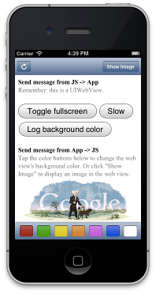

JockeyJS
========

JockeyJS is a dual-iOS and Android library that facilitates two-way communication between native applications and JavaScript apps running inside them.
It also supports communication between iframes running inside a webview.



Setup - iOS
-----

JockeyJS will help your iOS app communicate with a JavaScript application running inside a UIWebview.

1. Download the latest JockeyJS into your iOS project directory.
1. Add `JockeyJS/includes/Jockey.m` and `Jockey.h` to your project by right clicking inside XCode's Project Navigator and selecting "Add Files to \<YourProject\>"
1. In your web app, make sure to include `JockeyJS/js/jockey.js` as a script tag.
1. Last, set your ViewController as the delegate of your UIWebView (`JockeyViewController` in the example code), then add the following method to your ViewController's `.m` file:

```objective-c
-(BOOL)webView:(UIWebView *)webView shouldStartLoadWithRequest:(NSURLRequest *)request navigationType:(UIWebViewNavigationType)navigationType
{
	return [Jockey webView:webView withUrl:[request URL]];
}
```

Setup - Android
-----

JockeyJS will help your Android app communicate with a JavaScript application running inside a WebView.

1. Download the latest JockeyJS.Android project.
1. Add a library reference to JockeyJS.Android in your Android application (in Eclipse this is done through [Right-click Project]->Properties->Android->Add..)
1. In your web app make sure to include `JockeyJS/js/jockey.js` as a script tag.
1. Add Jockey into your app.

There are two ways you can use Jockey in your Android app.


The first is if you plan to use Jockey in only one activity or want to keep instances seperate between activities
```Java

//Declare an instance of Jockey
Jockey jockey;

//The WebView that we will be using, assumed to be instantiated either through findViewById or some method of injection.
WebView webView;

WebViewClient myWebViewClient;

@Override
protected void onStart() {
	super.onStart();

	//Get the default JockeyImpl
	jockey = JockeyImpl.getDefault();

	//Configure your webView to be used with Jockey
	jockey.configure(webView);

	//Pass Jockey your custom WebViewClient
	//Notice we can do this even after our webView has been configured.
	jockey.setWebViewClient(myWebViewClient)

	//Set some event handlers
	setJockeyEvents();

	//Load your webPage
	webView.loadUrl("file:///your.url.com");
}

```

The second option is to make use of the JockeyService, this is useful if you would like to share event handlers
across several activities or applications, or you just want to make sure that Jockey's lifecycle is explicitly bound
to your application's lifecycle.

Here is an example of how to bind to the JockeyService locally, please see the [Android docs](http://developer.android.com/reference/android/app/Service.html#LocalServiceSample) for more detail on this process.

####Important
If you will be using Jockey as a Service make sure to include it in your applicaiton manifest, otherwise you will
not be able to bind it.

```Java
//First we declare the members involved in using Jockey

//A WebView to interact with
private WebView webView;

//Our instance of the Jockey interface
private Jockey jockey;

//A helper for binding services
private boolean _bound;

//A service connection for making use of the JockeyService
private ServiceConnection _connection = new ServiceConnection() {
	@Override
	public void onServiceDisconnected(ComponentName name) {
		_bound = false;
	}

	@Override
	public void onServiceConnected(ComponentName name, IBinder service) {
		JockeyBinder binder = (JockeyBinder) service;

		//Retrieves the instance of the JockeyService from the binder
		jockey = binder.getService();

		//This will setup the WebView to enable JavaScript execution and provide a custom JockeyWebViewClient
		jockey.configure(webView);

		//Make Jockey start listening for events
		setJockeyEvents();

		_bound = true;

		//Redirect the WebView to your webpage.
		webView.loadUrl("file:///android_assets/index.html");
	}

}

///....Other member variables....////


//Then we bind the JockeyService to our activity through a helper function in our onStart method
@Override
protected void onStart() {
	super.onStart();
	JockeyService.bind(this, _connection);
}

//In order to bind this with the Android lifecycle we need to make sure that the service also shuts down at the appropriate time.
@Override
protected void onStop() {
	super.onStop();
	if (_bound) {
		JockeyService.unbind(this, _connection);
	}
}
```

Setup - Other Platform
-----

JockeyJS will help your app communicate with a JavaScript application running inside an Iframe.

1. Download the latest JockeyJS into your app's project directory.
1. In your web app, make sure to include `JockeyJS/js/jockey.js` as a script tag.
1. Include an iframe with the application running inside your app.
1. Configure Jockey with the target iframe your app will communicate with (this part is optional):

```javascript
Jockey.restrictIframeDispatcher('http://www.example.com', $('iframe')[0].contentWindow)
```

You're all set! Now you can start passing events.

Sending events from app to JavaScript
-------------------------------------
JockeyJS allows you to not only send events to the JavaScript application, but you can also receive a callback in the form of a block when all JavaScript listeners have finished executing. There are two methods available:

#####iOS

```objective-c
// Send an event to JavaScript, passing a payload.
// payload can be an NSDictionary or NSArray, or anything that is serializable to JSON.
// It can be nil.
[Jockey send:@"event-name" withPayload:payload toWebView:webView];

// If you want to send an event and also execute code within the iOS app when all
// JavaScript listeners have finished processing.
[Jockey send:@"event-name" withPayload:payload toWebView:webView perform:^{
  // Respond to callback.
}];
```

#####Android

```Java
// Send an event to JavaScript, passing a payload
jockey.send("event-name", webView, payload);

//With a callback to execute after all listeners have finished
jockey.send("event-name", webView, payload, new JockeyCallback() {
	@Override
	public void call() {
		//Your execution code
	}
});


```

#####Other platforms

Using iframes communication is identical for both the sender and receiver (parent app and app running inside the iframe). The following examples are the same as the ones of sending events from Javascript to the app:

```javascript
// Send an event to internal Iframe, passing a payload

// Send an event to iframe app.
Jockey.send("event-name");

// Send an event to iframe app, passing an optional payload.
Jockey.send("event-name", {
  key: "value"
});

// Send an event to iframe app, pass an optional payload, and catch the callback when all the
// iframe app listeners have finished processing.
Jockey.send("event-name", {
  key: "value"
}, function() {
  alert("Iframe app has finished processing!");
});
```


Receiving events from app in JavaScript
---------------------------------------
Event listeners in Jockey are modeled after JQuery's event listeners (but far less featureful). To receive the above events in JavaScript, simply add the following to your JavaScript application:

```javascript
// Listen for an event from iOS and log the payload.
Jockey.on("event-name", function(payload) {
  console.log(payload);
});
```

You can also pass a slightly different function to `on()` in cases where your listener fires off other events and you don't want to send a callback to iOS until those events are completed. e.g.,

```javascript
// Listen for an event from iOS, but don't notify iOS we've completed processing
// until an asynchronous function has finished (in this case a timeout).
Jockey.on("event-name", function(payload, complete) {
  // Example of event'ed handler.
  setTimeout(function() {
    alert("Timeout over!");
    complete();
  }, 1000);
});
```

```javascript
// Stop listening to an event from ios
Jockey.off("event-name");
```


Sending events from JavaScript to app
-------------------------------------
Similar to iOS above, Jockey's JavaScript library lets you pass events from your JavaScript application to your iOS app.

```javascript
// Send an event to iOS.
Jockey.send("event-name");

// Send an event to iOS, passing an optional payload.
Jockey.send("event-name", {
  key: "value"
});

// Send an event to iOS, pass an optional payload, and catch the callback when all the
// iOS listeners have finished processing.
Jockey.send("event-name", {
  key: "value"
}, function() {
  alert("iOS has finished processing!");
});
```

Receiving events from JavaScript in app
---------------------------------------

#####iOS

Like JavaScript above, Jockey's iOS library has methods to easily help you listen for events sent from your JavaScript application:

```objective-c

// Listen for an event from JavaScript and log the payload.
[Jockey on:@"event-name" perform:^(NSDictionary *payload) {
  NSLog(@"payload = %@", payload);
}];

// Listen for an event from JavaScript, but don't notify the JavaScript that
// the listener has completed until an asynchronous function has finished.
[Jockey on:@"event-name" performAsync:^(NSDictionary *payload, void (^complete)()) {
  // Do something asynchronously, then call the complete() method when finished.
}];

// Stop listening for events from javascript, Jockey is a shared instance after first initialization
// If you're webview controller is initialized and deinitialized, this is useful.
[Jockey off:@"event-name"];
```

#####Android

```Java

//Listen for an event from JavaScript and log a message when we have receied it.
jockey.on("event-name", new JockeyHandler() {
	@Override
	protected void doPerform(Map<Object, Object> payload) {
		Log.d("jockey", "Things are happening");
	}
});

//Listen for an event from JavaScript, but don't notify the JavaScript that the listener has completed
//until an asynchronous function has finished
//Note: Because this method is executed in the background, if you want the method to interact with the UI thread
//it will need to use something like a android.os.Handler to post to the UI thread.
jockey.on("event-name", new JockeyAsyncHandler() {
	@Override
	protected void doPerform(Map<Object, Object> payload) {
		//Do something asynchronously
		//No need to called completed(), Jockey will take care of that for you!
	}
});


//We can even chain together several handlers so that they get processed in sequence.
//Here we also see an example of the NativeOS interface which allows us to chain some common
//system handlers to simulate native UI interactions.
jockey.on("event-name", nativeOS(this)
			.toast("Event occurred!")
			.vibrate(100), //Don't forget to grant permission
			new JockeyHandler() {
				@Override
				protected void doPerform(Map<Object, Object> payload) {
				}
			}
);

//...More Handlers


//If you would like to stop listening for a specific event
jockey.off("event-name");

//If you would like to stop listening to ALL events
jockey.clear();

```

#####Other platforms

```javascript
//Listen for an event from JavaScript and log the payload.
Jockey.on("event-name", function(payload) {
  console.log(payload);
});

//If you would like to stop listening for a specific event
Jockey.off("event-name");
```

Security
--------

#####iOS

You'll want to make sure your iOS app only responds to events sent from domains you control (for instance, if your UIWebView allows the user to navigate to other pages, you don't want those other pages to be able to communicate with or control your iOS app). To do this, simply add a check within the method you added to your ViewController during setup:

```objective-c
-(BOOL)webView:(UIWebView *)webView shouldStartLoadWithRequest:(NSURLRequest *)request navigationType:(UIWebViewNavigationType)navigationType
{
    // Get current URL of the webview through Javascript.
    NSString *urlString = [_webView stringByEvaluatingJavaScriptFromString:@"window.location.href"];
    NSURL *currentURL = [NSURL URLWithString:urlString];

    NSString *host = [currentURL host];

    if ([host isEqualToString:@"mydomain.com") {
        return [Jockey webView:webView withUrl:[request URL]];
    }

    return TRUE;
}
```

#####Android

```Java

jockey.setValidationListener(new OnValidateListener() {
	@Override
	public boolean validate(String host) {
		return "mydomain.com".equals(host);
	}
});

```

#####Other platforms

For communication between iframes, jockey uses [window.postMessage()](https://developer.mozilla.org/en-US/docs/Web/API/Window/postMessage). The default target domain is '*' and the default target frame is `window.parent`, meaning that the sender/receiver iframe is not verified. It is advised to always restrict the target iframe:

```javascript

// Restricts the target domain and target frame
Jockey.restrictIframeDispatcher('http://www.example.com', $('iframe')[0].contentWindow)
```

Contributors
------------

* @tcoulter - original author (iOS only)
* @paulpdaniels - Android support


