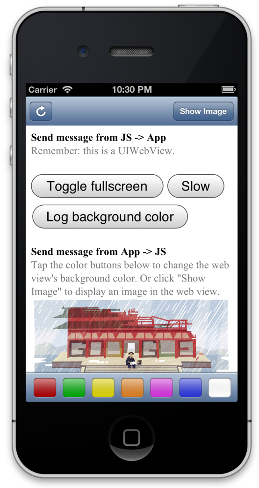

JockeyJS
========

JockeyJS is an iOS and JS library that facilitates two-way communication between iOS apps and JavaScript apps running inside them. 

There's a desire for Android support and the Android JavaScript dispatcher has been stubbed out. If you can contribute, please do!



Setup
-----

JockeyJS will help your iOS app communicate with a JavaScript application running inside a UIWebview.

1. Download the latest JockeyJS into your iOS project directory.
1. Add `JockeyJS/includes/Jockey.m` and `Jockey.h` to your project by right clicking inside XCode's Project Navigator and selecting "Add Files to \<YourProject\>"
1. In your web app, make sure to include `JockeyJS/js/jockey.js` as a script tag. 
1. Last, set your ViewController as the delegate of your UIWebView (`JockeyViewController` in the example code), then add the following method to your ViewController's `.m` file:
   
```objective-c
-(BOOL)webView:(UIWebView *)webView shouldStartLoadWithRequest:(NSURLRequest *)request navigationType:(UIWebViewNavigationType)navigationType
{
	return [Jockey webView:webView withUrl:[request URL]];
}
```

You're all set! Now you can start passing events. 

Sending events from iOS to JavaScript
-------------------------------------
JockeyJS allows you to not only send events to the JavaScript application, but you can also receive a callback in the form of a block when all JavaScript listeners have finished executing. There are two methods available:

```objective-c
// Send an event to JavaScript, passing a payload. 
// payload can be an NSDictionary or NSArray, or anything that is serializable to JSON.
// It can be nil.
[Jockey send:@"event-name" withPayload:payload toWebView:webView];

// If you want to send an event and also execute code within the iOS app when all
// JavaScript listeners have finished processing. 
[Jockey send:@"event-name" withPayload:payload toWebView:webView perform:^{
  // Respond to callback.
}];
```

Receiving events from iOS in JavaScript
---------------------------------------
Event listeners in Jockey are modeled after JQuery's event listeners (not far less featureful). To receive the above events in JavaScript, simply add the following to your JavaScript application:

```javascript
// Listen for an event from iOS and log the payload.
Jockey.on("event-name", function(payload) {
  console.log(payload);
});
```

You can also pass a slightly different function to `on()` in cases where your listener fires off other events and you don't want to send a callback to iOS until those events are completed. e.g.,

```javascript
// Listen for an event from iOS, but don't notify iOS we've completed processing
// until an asynchronous function has finished (in this case a timeout).
Jockey.on("event-name", function(payload, complete) {
  // Example of event'ed handler.
  setTimeout(function() {
    alert("Timeout over!");
    complete();
  }, 1000);
});
```

Sending events from JavaScript to iOS
-------------------------------------
Similar to iOS above, Jockey's JavaScript library lets you pass events from your JavaScript application to your iOS app.

```javascript
// Send an event to iOS.
Jockey.send("event-name");

// Send an event to iOS, passing an optional payload. 
Jockey.send("event-name", {
  key: "value"
});

// Send an event to iOS, pass an optional payload, and catch the callback when all the 
// iOS listeners have finished processing.
Jockey.send("event-name", {
  key: "value"
}, function() {
  alert("iOS has finished processing!");
});
```

Receiving events from JavaScript in iOS
---------------------------------------
Like JavaScript above, Jockey's iOS library has methods to easily help you listen for events sent from your JavaScript application:

```objective-c

// Listen for an event from JavaScript and log the payload.
[Jockey on:@"event-name" perform:^(NSDictionary *payload) {
  NSLog(@"payload = %@", payload);
}];

// Listen for an event from JavaScript, but don't notify the JavaScript that 
// the listener has completed until an asynchronous function has finished.
[Jockey on:@"event-name" performAsync:^(NSDictionary *payload, void (^complete)()) {
  // Do something asynchronously, then call the complete() method when finished.
}];
```

Security
--------
You'll want to make sure your iOS app only responds to events sent from domains you control (for instance, if your UIWebView allows the user to navigate to other pages, you don't want those other pages to be able to communicate with or control your iOS app). To do this, simply add a check within the method you added to your ViewController during setup:

```objective-c
-(BOOL)webView:(UIWebView *)webView shouldStartLoadWithRequest:(NSURLRequest *)request navigationType:(UIWebViewNavigationType)navigationType
{
    # Get current URL of the webview through Javascript.
    NSString *urlString = [_webView stringByEvaluatingJavaScriptFromString:@"window.location.href"];
    NSURL *currentURL = [NSURL URLWithString:urlString];
    
    NSString *host = [currentURL host];

    if ([host isEqualToString:@"mydomain.com") {
        return [Jockey webView:webView withUrl:[request URL]];
    }
    
    return TRUE;
}
```


